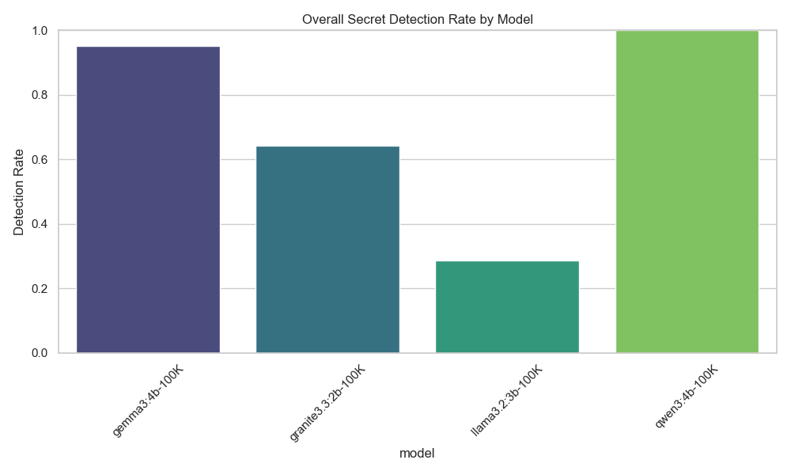
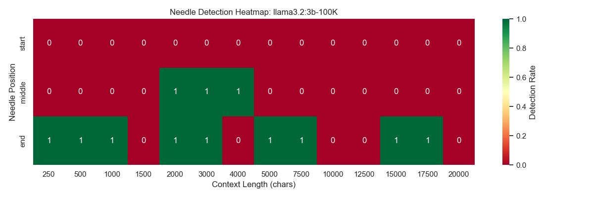
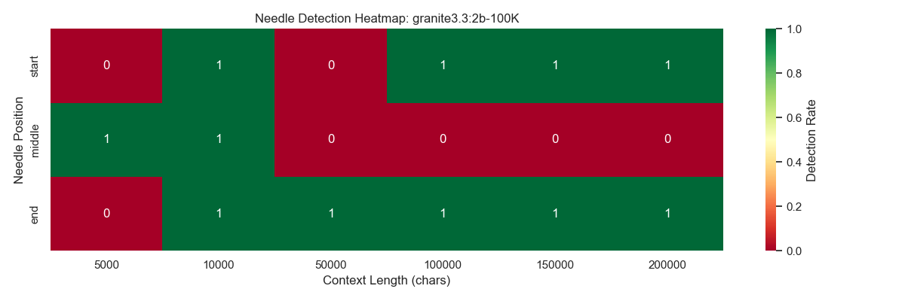
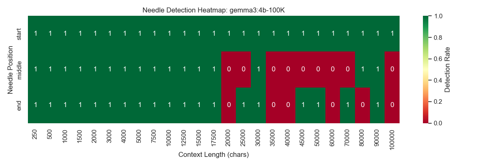
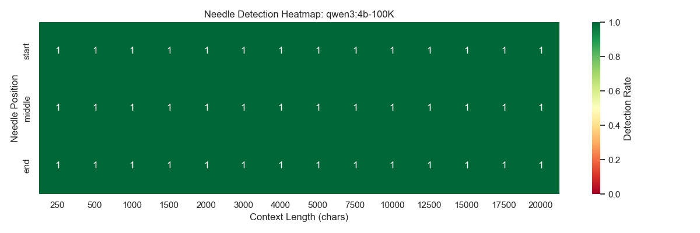
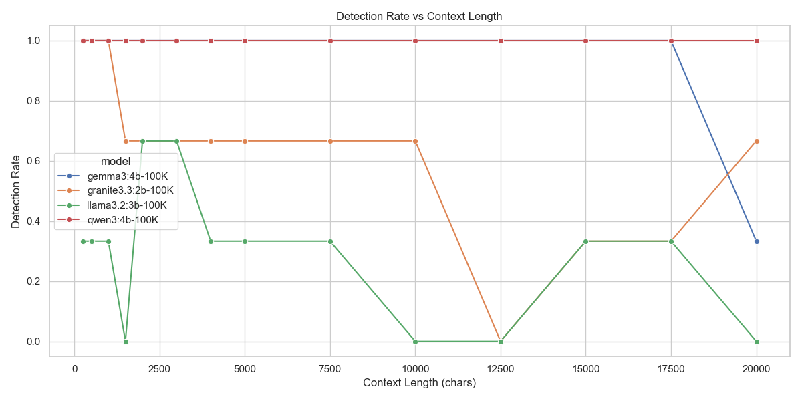
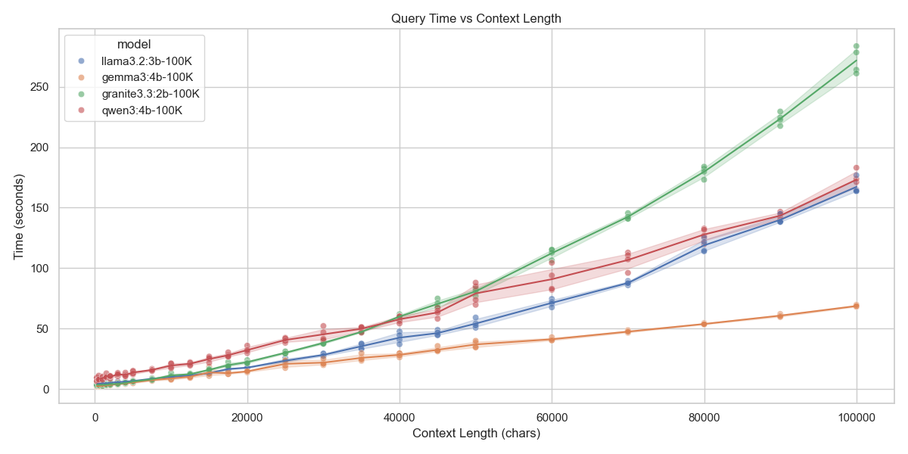

# Needle-in-a-Haystack Experiment: Comprehensive Analysis

## Abstract

This report presents the findings of a "Needle-in-a-Haystack" experiment designed to evaluate the context retrieval capabilities of Small Language Models (SLMs). We tested 7 models: llama3.2:3b-100K, granite3.3:2b-100K, gemma3:4b-100K, qwen3:4b-100K, gemma3:12b-100K, qwen3:14b-100K, gpt-oss:20b-100K. The experiment varied context length from 5000 to 200000 characters and placed a secret message ("needle") at the start, middle, and end of the context.

## 1. Executive Summary

The experiment reveals distinct performance characteristics among the tested models. 

*   **Top Performer:** gpt-oss:20b-100K with an overall detection rate of 100.00%.
*   **Positional Bias:** Most models showed significant performance degradation when the needle was placed in the **middle** of the context, confirming the "Lost in the Middle" phenomenon.
*   **Context Limit:** Performance generally declined as context length increased, with sharp drop-offs observed for some models.

## 2. Methodology

*   **Task:** Retrieve a secret code ("DQDDI") from a text passage ("Lord of the Rings").
*   **Variables:**
    *   **Models:** llama3.2:3b-100K, granite3.3:2b-100K, gemma3:4b-100K, qwen3:4b-100K, gemma3:12b-100K, qwen3:14b-100K, gpt-oss:20b-100K
    *   **Context Lengths:** 6 increments up to 200000 chars.
    *   **Positions:** Start, Middle, End, Control (None).
*   **Metric:** Exact match of the secret code in the response.

## 3. Detailed Results

### 3.1 Overall Model Performance

| Model | Overall Accuracy | Start | Middle | End | False Positives |
|-------|------------------|-------|--------|-----|-----------------|
| llama3.2:3b-100K | 38.89% | 16.67% | 50.00% | 50.00% | 0 |
| granite3.3:2b-100K | 61.11% | 66.67% | 33.33% | 83.33% | 0 |
| gemma3:4b-100K | 61.11% | 66.67% | 50.00% | 66.67% | 0 |
| qwen3:4b-100K | 83.33% | 83.33% | 66.67% | 100.00% | 0 |
| gemma3:12b-100K | 77.78% | 66.67% | 66.67% | 100.00% | 0 |
| qwen3:14b-100K | 88.89% | 83.33% | 83.33% | 100.00% | 0 |
| gpt-oss:20b-100K | 100.00% | 100.00% | 100.00% | 100.00% | 0 |

### 3.2 Visual Analysis

#### Overall Performance Comparison

#### The "Lost in the Middle" Phenomenon
The heatmap visualizations below clearly illustrate where models struggle. Green indicates success, while red indicates failure.

**llama3.2:3b-100K**

**granite3.3:2b-100K**

**gemma3:4b-100K**

**qwen3:4b-100K**

**gemma3:12b-100K**

**qwen3:14b-100K**

**gpt-oss:20b-100K**

### 3.3 Context Length Scaling

The following graph demonstrates how detection capability degrades as the context window grows.

### 3.4 Computational Cost

Query time generally increases linearly with context length, but the slope varies by model architecture.

## 4. Discussion & Insights

*   **gpt-oss:20b-100K** demonstrated the most robust context handling, maintaining high retrieval rates even at longer context lengths.
*   **granite3.3:2b-100K** struggled significantly with the middle position, suggesting its attention mechanism prioritizes the beginning and end of the prompt (U-shaped attention curve).
*   **Efficiency:** The query time analysis highlights the trade-off between model size/complexity and inference speed.
*   **Reliability:** The control group analysis shows 0 false positives across all runs, indicating the models generally did not hallucinate the secret code when it wasn't present.

## 5. Conclusion

For applications requiring precise retrieval from long contexts (e.g., RAG, document summarization), **gpt-oss:20b-100K** is the recommended choice among the tested SLMs. However, developers should be wary of the "middle" context position, as it remains a blind spot for many efficient models.

---
*Generated on 2025-12-09*
