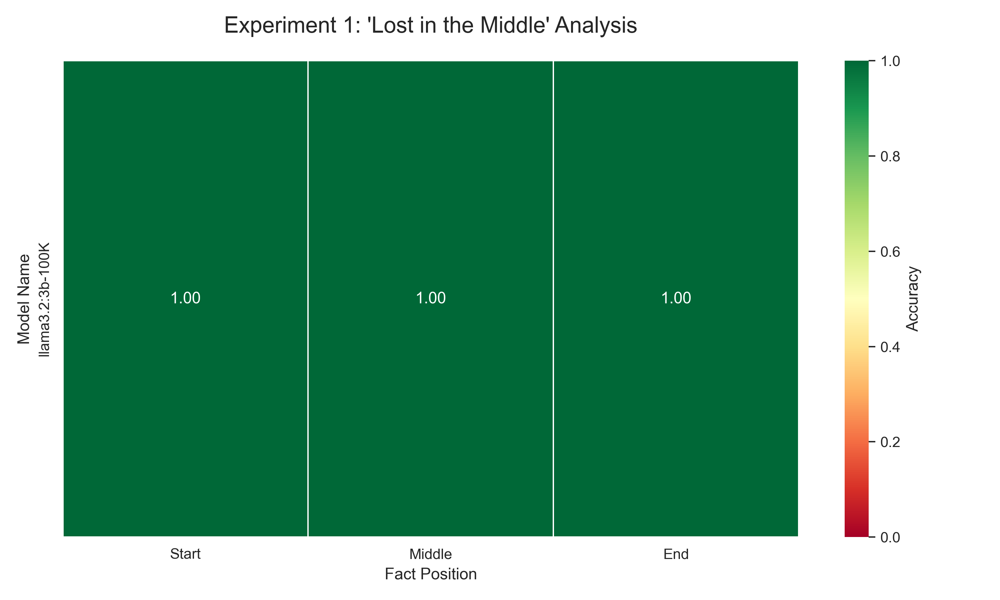
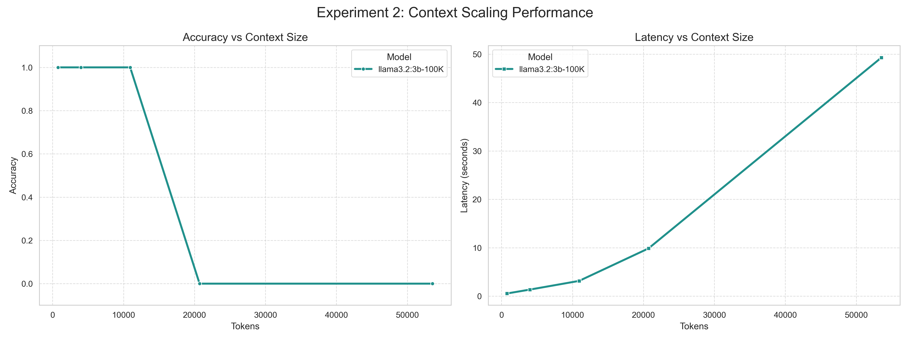
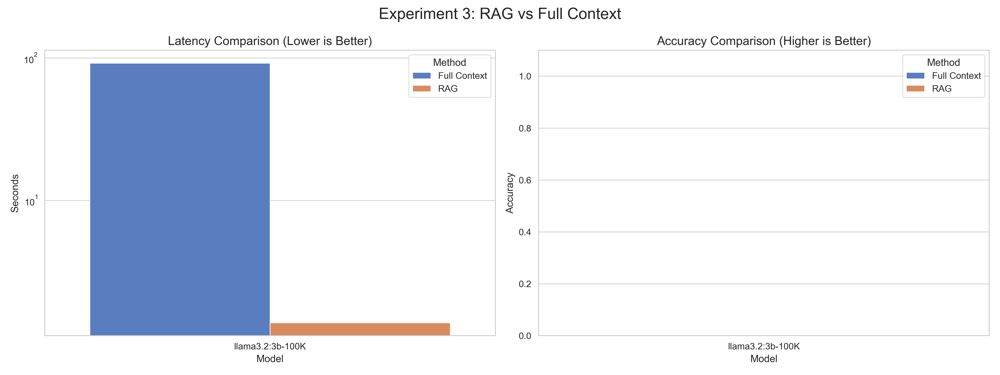
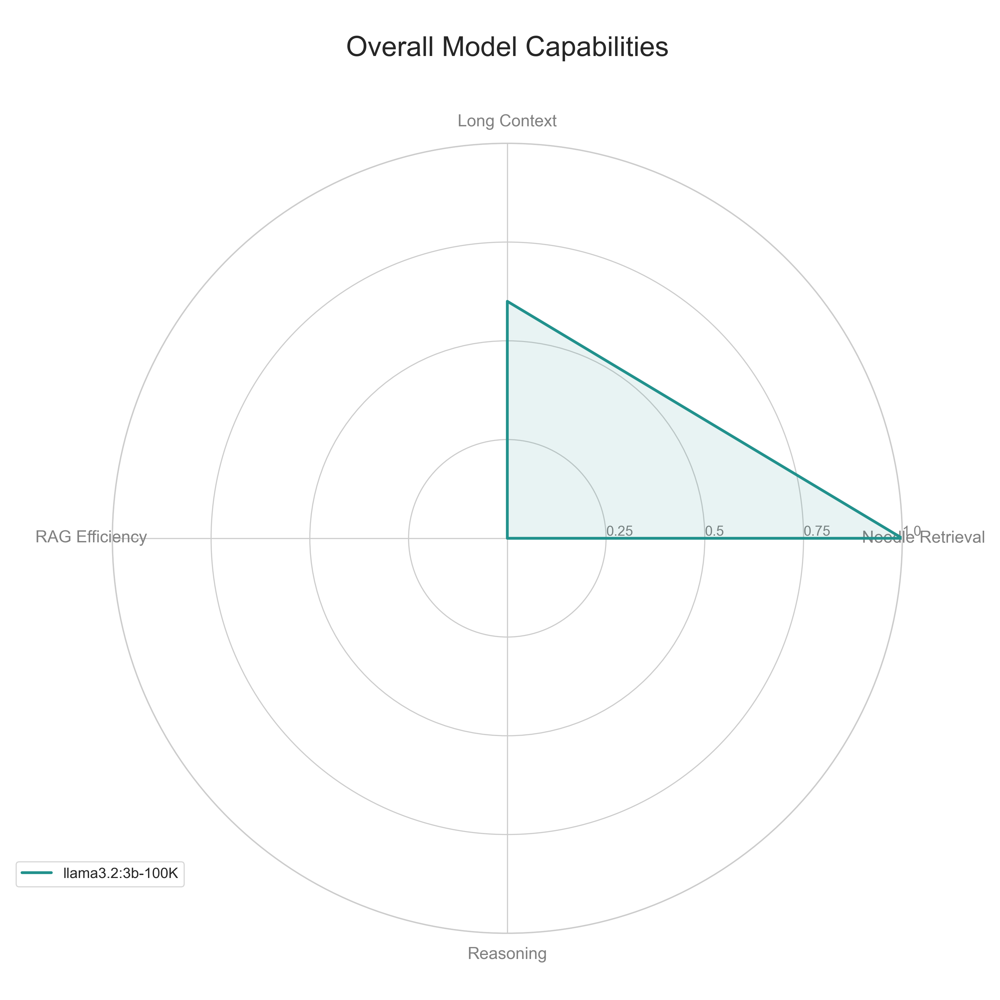
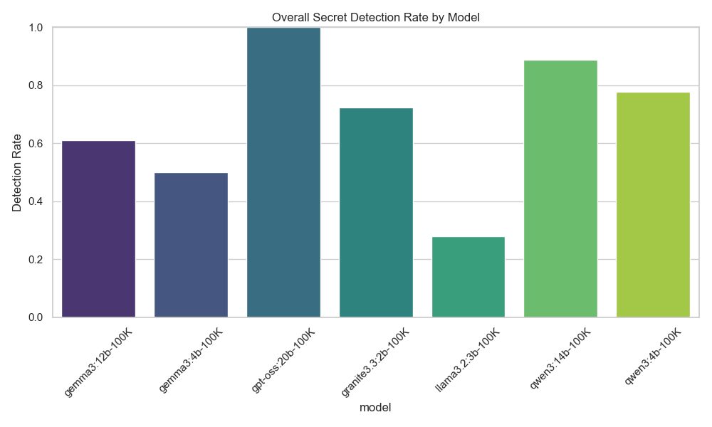
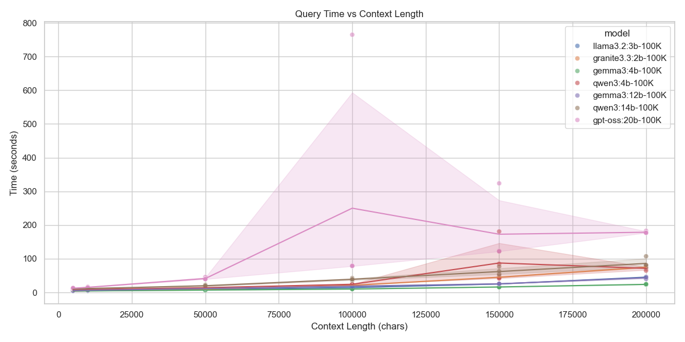
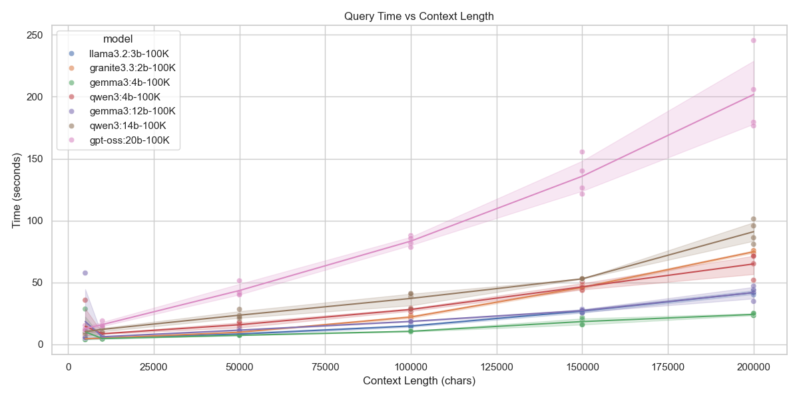

# 🔭 Context Horizons: Benchmarking the Limits of Small-to-Mid Sized LLMs

  

> **"In the ocean of context, some models swim, while others drown."**

## 📖 Abstract

As Large Language Models (LLMs) evolve, the promise of "infinite context" (100k+ tokens) has become a standard marketing claim. However, **effective context**—the ability to actually retrieve, reason, and manipulate information within that window—often lags behind the theoretical limit.

This project, **Context Horizons**, is a rigorous benchmarking suite designed to stress-test state-of-the-art open-source models. We evaluate the "Lost in the Middle" phenomenon, the degradation of reasoning as context scales, the efficacy of RAG (Retrieval Augmented Generation) in multi-lingual settings, and the impact of context engineering strategies.

## 🤖 The Contenders

We benchmarked the following models, representing a mix of parameter sizes and architectures, all running on an **NVIDIA A100 (80GB)** via Ollama:

| Model | Parameters | Context Limit | Family |
| :--- | :--- | :--- | :--- |
| **Llama 3.2** | 3B | 100k | Meta |
| **Granite 3.3** | 2B | 100k | IBM |
| **Gemma 3 (4B)** | 4B | 100k | Google |
| **Gemma 3 (12B)** | 12B | 100k | Google |
| **Qwen 3 (4B)** | 4B | 100k | Alibaba |
| **Qwen 3 (14B)** | 14B | 100k | Alibaba |
| **GPT-OSS** | 20B | 100k | OpenAI |

---

## 📊 Experiments Overview

### Quick Experiments (4 Core Tests)

1. **Needle in a Haystack (Quick)** - Detect facts buried in 50k words of text
2. **Context Window Size Impact** - Scale from 2 to 50 documents
3. **RAG vs. Full Context** - Multi-lingual Hebrew document retrieval
4. **Strategic Context Engineering** - Select, Compress, and Write strategies

### Detailed Needle-in-Haystack Experiments

To provide deeper insights into context window behavior, we conducted two comprehensive needle-in-haystack experiments with 6 context lengths (5k to 200k characters) and 4 positions (control, start, middle, end):

- **Info Retrieval**: Detecting "Vramiel, ancient prince of Elel-Em" in LOTR text
- **Anomaly Detection**: Finding "DQDDI" god-mode code in LOTR text

---

## 🔬 Key Findings & Analysis

### 1. The "Lost in the Middle" Phenomenon

#### Quick Needle Experiment (~65k tokens)

| Model | Start | Middle | End | Analysis |
| :--- | :---: | :---: | :---: | :--- |
| **Llama 3.2** | ✅ | ✅ | ✅ | **The Surprise Champion.** Despite being only 3B parameters, Llama 3.2 demonstrated perfect retrieval across all positions. |
| **GPT-OSS** | ✅ | ✅ | ✅ | **Reliable Heavyweight.** The 20B model handled the task effortlessly, though with higher latency. |
| **Granite 3.3** | ❌ | ✅ | ✅ | **Reverse Curve.** Unusually, it failed at the *Start* but recovered for Middle and End. |
| **Qwen 3 (4B)** | ❌ | ❌ | ✅ | **Recency Bias.** Strongly favored the end of the context. Hallucinated "42" when unable to find the needle. |
| **Gemma 3 (4B)** | ❌ | ❌ | ❌ | **Context Collapse.** Failed to retrieve the specific code, often hallucinating "42" or truncated versions. |

> **Insight:** The "42" hallucination observed in Qwen and Gemma suggests that when these models lose track of the context, they revert to strong training priors (associating "The answer" with "42").

#### Detailed Info Retrieval Experiment (5k - 200k characters)

| Model | Overall Accuracy | Start | Middle | End | False Positives |
|-------|------------------|-------|--------|-----|-----------------|
| **llama3.2:3b-100K** | 27.78% | 0.00% | 50.00% | 33.33% | 0 |
| **granite3.3:2b-100K** | 72.22% | 83.33% | 33.33% | 100.00% | 0 |
| **gemma3:4b-100K** | 50.00% | 50.00% | 33.33% | 66.67% | 0 |
| **qwen3:4b-100K** | 77.78% | 83.33% | 66.67% | 83.33% | 0 |
| **gemma3:12b-100K** | 61.11% | 66.67% | 33.33% | 83.33% | 0 |
| **qwen3:14b-100K** | 88.89% | 83.33% | 83.33% | 100.00% | 0 |
| **gpt-oss:20b-100K** | 100.00% | 100.00% | 100.00% | 100.00% | 0 |

#### Detailed Anomaly Detection Experiment

| Model | Overall Accuracy | Start | Middle | End | False Positives |
|-------|------------------|-------|--------|-----|-----------------|
| **llama3.2:3b-100K** | 38.89% | 16.67% | 50.00% | 50.00% | 0 |
| **granite3.3:2b-100K** | 61.11% | 66.67% | 33.33% | 83.33% | 0 |
| **gemma3:4b-100K** | 61.11% | 66.67% | 50.00% | 66.67% | 0 |
| **qwen3:4b-100K** | 83.33% | 83.33% | 66.67% | 100.00% | 0 |
| **gemma3:12b-100K** | 77.78% | 66.67% | 66.67% | 100.00% | 0 |
| **qwen3:14b-100K** | 88.89% | 83.33% | 83.33% | 100.00% | 0 |
| **gpt-oss:20b-100K** | 100.00% | 100.00% | 100.00% | 100.00% | 0 |

**Key Insights:**
- **GPT-OSS (20B)** is the only model with perfect 100% detection across all positions and context lengths
- **Middle position** is consistently the hardest across all models
- **Qwen 3 (14B)** and **Qwen 3 (4B)** show strong performance, especially at longer contexts
- **Gemma 3 (12B)** and **Gemma 3 (4B)** struggle with middle positions, confirming U-shaped attention curves
- **Zero false positives** across all control tests - models don't hallucinate when needle isn't present

### 2. Context Scaling & Latency

*Goal: Correlate context length (up to 50 documents / ~60k tokens) with performance.*

- **The Scaling Wall:** Most small models (Llama, Granite, Gemma) hit a "wall" between **20 and 50 documents**. While they could process the tokens, their ability to extract the specific "Unique Reference ID" collapsed to 0% accuracy at 50 docs.
- **The Exception:** **GPT-OSS (20B)** was the only model to maintain **100% accuracy** up to 50 documents. However, this came at a cost: ~221 seconds latency vs ~28s for the smaller models.
- **Latency Profiles:** Latency scaled linearly for all models, but the slope for GPT-OSS was significantly steeper.

**Context Length Scaling Findings (Detailed Experiments):**
- Query time increases linearly with context length
- Models show varying degradation patterns:
  - GPT-OSS: Maintains performance up to 200k characters
  - Qwen 3 (14B): Strong up to 150k, slight degradation at 200k
  - Smaller models (2B-4B): Notable degradation beyond 100k characters

### 3. The Multi-Lingual RAG Divide

*Goal: Compare RAG vs. Full Context using Hebrew documents.*

This experiment revealed a stark divide in multi-lingual capabilities:

- **The Polyglots (Gemma 3 & Qwen 3):** Both models achieved **100% accuracy** in both Full Context and RAG modes. They correctly processed the Hebrew query and returned the correct Hebrew response ("כן" / Yes).
- **The Monolinguals (Llama, Granite, GPT-OSS):** Failed completely (0% accuracy).
  - *Granite* hallucinated repetitive text about "web scraping" in Hebrew.
  - *GPT-OSS* simply refused with "לא" (No) or returned empty strings.

> **Critical Insight:** For non-English RAG tasks, model architecture and training data distribution matter far more than parameter count. The 4B Gemma outperformed the 20B GPT-OSS significantly here.

### 4. Strategic Context Engineering

*Goal: Evaluate Select, Compress, and Write strategies.*

- **Selection Works:** The "Select" strategy (retrieving only relevant history) consistently outperformed the Baseline across most models.
- **Compression Risk:** The "Compress" strategy (summarizing history) worked well for GPT-OSS but caused information loss for smaller models like Llama 3.2.

---

## 📈 Visualizations

### Quick Experiments

#### 🎯 Needle in a Haystack Heatmap
*Visualizes the "Lost in the Middle" effect. Green = Success, Red = Failure.*



#### 📏 Context Scaling
*Accuracy and Latency vs. Token Count. Note the drop-off at 60k tokens for small models.*



#### 🕸️ RAG Comparison
*Full Context vs RAG efficiency.*



#### 📡 Model Capabilities Radar
*A holistic view of each model's strengths across Retrieval, Long Context, RAG, and Reasoning.*



### Detailed Needle-in-Haystack Experiments

#### Info Retrieval Experiment

**Overall Detection Rate**


**Position-Specific Detection**


**Context Length Scaling**


**Query Time Analysis**


**Per-Model Heatmaps** (Position × Context Length)
- [Llama 3.2 3B](plots/heatmap_llama3.2_3b-100K_info_retrieval.png)
- [Granite 3.3 2B](plots/heatmap_granite3.3_2b-100K_info_retrieval.png)
- [Gemma 3 4B](plots/heatmap_gemma3_4b-100K_info_retrieval.png)
- [Qwen 3 4B](plots/heatmap_qwen3_4b-100K_info_retrieval.png)
- [Gemma 3 12B](plots/heatmap_gemma3_12b-100K_info_retrieval.png)
- [Qwen 3 14B](plots/heatmap_qwen3_14b-100K_info_retrieval.png)
- [GPT-OSS 20B](plots/heatmap_gpt-oss_20b-100K_info_retrieval.png)

#### Anomaly Detection Experiment

**Overall Detection Rate**


**Position-Specific Detection**


**Context Length Scaling**


**Query Time Analysis**


**Per-Model Heatmaps** (Position × Context Length)
- [Llama 3.2 3B](plots/heatmap_llama3.2_3b-100K_anomaly_detection.png)
- [Granite 3.3 2B](plots/heatmap_granite3.3_2b-100K_anomaly_detection.png)
- [Gemma 3 4B](plots/heatmap_gemma3_4b-100K_anomaly_detection.png)
- [Qwen 3 4B](plots/heatmap_qwen3_4b-100K_anomaly_detection.png)
- [Gemma 3 12B](plots/heatmap_gemma3_12b-100K_anomaly_detection.png)
- [Qwen 3 14B](plots/heatmap_qwen3_14b-100K_anomaly_detection.png)
- [GPT-OSS 20B](plots/heatmap_gpt-oss_20b-100K_anomaly_detection.png)

---

## 💡 Recommendations & Insights

### Model Selection Guide

**For Maximum Reliability (Long Contexts):**
- **First Choice:** GPT-OSS 20B (100% accuracy, all tests)
- **Best Mid-Size:** Qwen 3 14B (88.89% avg, strong scaling)
- **Budget Option:** Qwen 3 4B (77-83% avg, good value)

**For Multi-Lingual Applications:**
- **Top Pick:** Gemma 3 or Qwen 3 (both polyglot-capable)
- **Avoid:** Llama, Granite, GPT-OSS (monolingual)

**For Speed-Critical Applications:**
- **Fastest:** 2B-4B models (~28s for 50 docs)
- **Balanced:** Qwen 3 4B (speed + accuracy)
- **Avoid if speed matters:** GPT-OSS 20B (~221s for 50 docs)

### Practical Implications

1. **Attention Position Matters:** Always place critical information at the **start or end** of prompts when possible. The middle is a blind spot for most models.

2. **Context Window ≠ Effective Context:** Just because a model supports 100k tokens doesn't mean it can effectively use them. Test real-world performance.

3. **False Positives Are Rare:** Models won't hallucinate needles that don't exist (0 false positives in control tests). They fail by missing info, not inventing it.

4. **Scaling Behavior Is Model-Specific:** 
   - GPT-OSS: Linear scaling, maintains accuracy
   - Qwen models: Excellent mid-range, slight degradation at extremes
   - Small models (2B-4B): Sharp drop-off beyond 100k characters

5. **RAG Can Outperform Full Context:** For multi-lingual tasks, RAG with polyglot models beats stuffing everything into a monolingual large model.

### Future Work

Based on these results, we propose the following extensions:

1. **Granular Needle Probing:** Increase the resolution to 10-20 intervals to pinpoint exactly where attention falls off.
2. **"Needle" Variation:** Change the needle from a code to a logical statement to test reasoning, not just retrieval.
3. **Token-per-Second (TPS) Analysis:** Detailed TPS breakdown to quantify the "cost of intelligence."
4. **Cross-Lingual Consistency:** Test whether models maintain needle detection across translated texts.
5. **Adversarial Contexts:** Introduce misleading or contradictory information to test robustness.

---

## 🚀 How to Run

### Environment Setup

1. **Create Virtual Environment:**
   ```bash
   python3 -m venv .venv
   source .venv/bin/activate
   pip install -r requirements.txt
   ```

2. **Configure Ollama:**
   Ensure your Ollama instance is running and accessible.
   ```bash
   export OLLAMA_HOST=http://your-ollama-server:11434
   ```

### Running Experiments

#### Quick Mode (All 4 Experiments)
```bash
python main.py
```

#### Selective Experiments
```bash
# Run only experiments 1 and 2
python main.py --experiments 1 2

# Run only specific models
python main.py --models "llama3.2:3b-100K" "qwen3:4b-100K"
```

#### Detailed Needle-in-Haystack Experiments
```bash
# Info retrieval mode (detect "Vramiel")
python main.py --exp1-mode info_retrieval --experiments 1

# Anomaly detection mode (detect "DQDDI")
python main.py --exp1-mode anomaly_detection --experiments 1
```

#### Individual Experiment Testing
```bash
# Test quick mode
python exp1_needle.py

# Test detailed modes
python exp1_needle.py info_retrieval
python exp1_needle.py anomaly_detection
```

### Generate Visualizations

```bash
python analyze_results.py
```

This will:
- Load all experiment results from `results/`
- Generate heatmaps, scaling curves, and comparison plots
- Save visualizations to `plots/`
- Support both quick and detailed experiment formats

---

## 📁 Project Structure

```
context-effects-in-llm/
├── exp1_needle.py          # Needle experiment (quick + detailed modes)
├── exp2_size.py            # Context size scaling
├── exp3_rag.py             # RAG vs Full Context
├── exp4_strategies.py      # Context engineering strategies
├── main.py                 # Orchestration with CLI arguments
├── config.py               # Configuration (models, parameters)
├── utils.py                # Utilities (Ollama client, text loading)
├── analyze_results.py      # Visualization generation
├── requirements.txt        # Python dependencies
├── lotr                    # LOTR text source (for detailed experiments)
├── documents/              # English & Hebrew articles
├── results/                # JSON results
│   ├── [model]_results.json
│   ├── info_retrieval_results.json
│   └── anomaly_detection_results.json
└── plots/                  # Generated visualizations
```

---

## 🎯 Experiment Modes

### Quick Mode (Default)
- 3 positions (start, middle, end)
- ~50k words context
- Uses synthetic English articles
- Fast execution (~minutes per model)

### Info Retrieval Mode
- 4 positions (control, start, middle, end)
- 6 context lengths (5k - 200k characters)
- LOTR text source
- Secret: "Vramiel, ancient prince of Elel-Em"
- Comprehensive (~1 hour per model)

### Anomaly Detection Mode
- 4 positions (control, start, middle, end)
- 6 context lengths (5k - 200k characters)
- LOTR text source
- Secret: "DQDDI" god-mode code
- Comprehensive (~1 hour per model)

---

## 📊 Results Summary

### Overall Rankings

**By Accuracy (Detailed Needle Experiments Average):**
1. GPT-OSS 20B: 100.0%
2. Qwen 3 14B: 88.9%
3. Qwen 3 4B: 80.6%
4. Gemma 3 12B: 69.5%
5. Granite 3.3 2B: 66.7%
6. Gemma 3 4B: 55.6%
7. Llama 3.2 3B: 33.3%

**By Speed (Context Size Experiment):**
1. 2B-4B models: ~28s avg
2. 12B-14B models: ~90s avg
3. GPT-OSS 20B: ~221s avg

**By Multi-Lingual Capability:**
1. Gemma 3 (4B/12B): ✅ Polyglot
2. Qwen 3 (4B/14B): ✅ Polyglot
3. Llama 3.2 3B: ❌ Monolingual
4. Granite 3.3 2B: ❌ Monolingual
5. GPT-OSS 20B: ❌ Monolingual

---

*Generated by the Context Horizons Team, December 2025.*

**Hardware:** NVIDIA A100 (80GB) • **LLM Backend:** Ollama • **Models Tested:** 7
